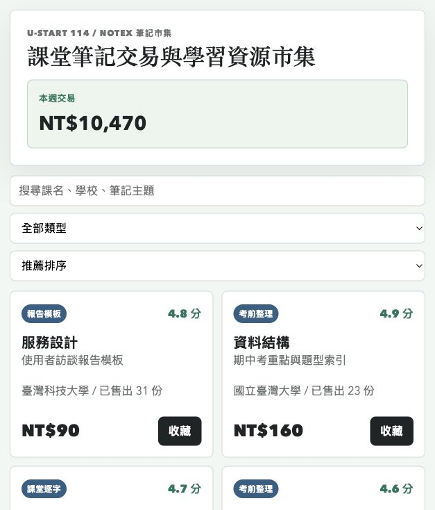
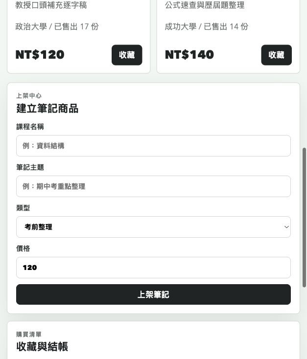

# NoteX 筆記市集原型

## 快速看懂

- 線上 Demo：https://atlasforcn.github.io/startup-notex-marketplace/
- 這個原型在做什麼：把 NoteX 做成筆記交易與學習資源市集。
- 特色定位：特色是把學生筆記、評價、交易與學習需求放在同一個輕量市集流程。
- 操作流程：瀏覽課程筆記與分類 → 查看價格、評價與內容摘要 → 加入收藏/購買流程並追蹤學習資源

展開完整功能流程截圖

## 比賽來源

- 競賽：U-start 創新創業計畫
- 屆次：114 年度第二階段績優團隊
- 得獎作品：NoteX 筆記市集
- 學校：國立臺灣大學
- 公司：化語匯數位科技有限公司
- 類別：文創教育
- 官方來源：https://ustart.yda.gov.tw/p/405-1000-2178,c147.php?Lang=zh-tw

## 核心概念

依公開名稱「筆記市集」理解，本原型把作品概念實作為學生學習資源交易平台：筆記上架、課程搜尋、類型篩選、收藏、交易草稿與評價資訊。

## 功能

- 搜尋課程、學校與筆記主題
- 依考前整理、課堂逐字、報告模板篩選
- 依推薦、價格、評價排序
- 建立新筆記商品
- 收藏筆記並產生交易草稿

## 聲明

本 repo 是依官方公開得獎名稱建立的概念原型，不代表原團隊授權產品，也未使用原團隊商標、素材或未公開資料。
